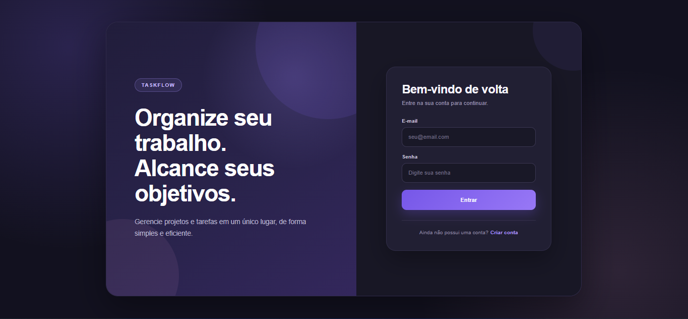
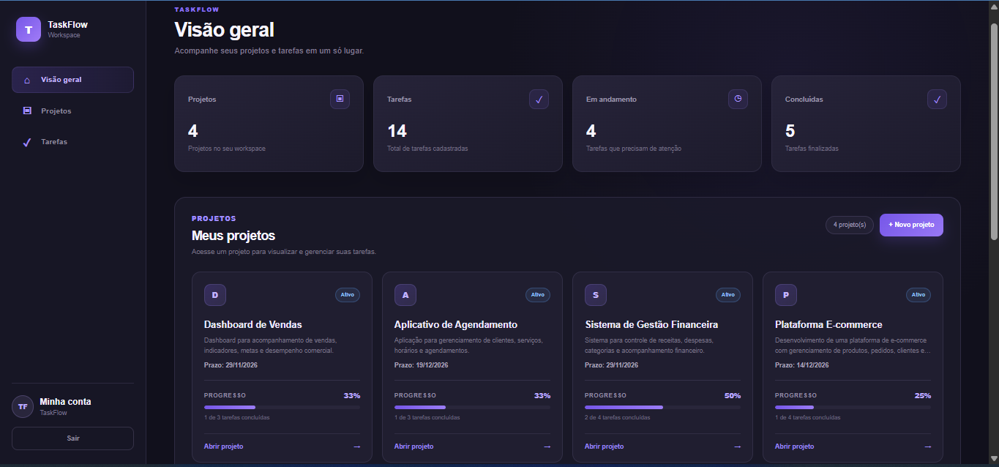
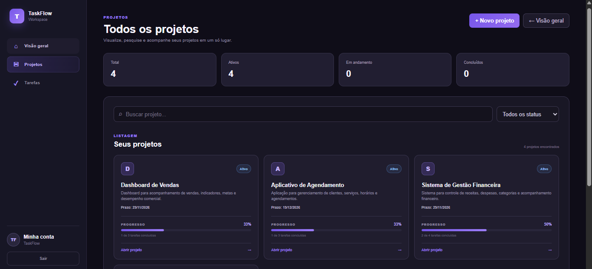
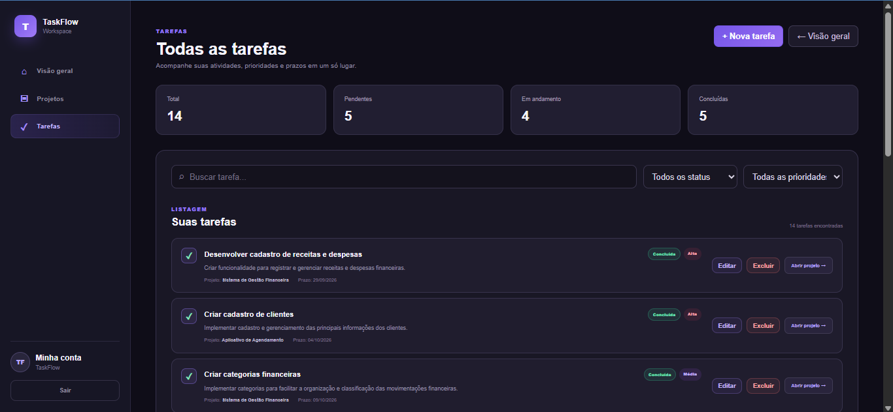

# TaskFlow

TaskFlow is a full-stack web application for project and task management, designed to help users organize their work, manage projects and tasks, and track progress through a modern and intuitive interface.

🌐 **Live Application:** https://taskflow-frontend-ja2y.onrender.com

---

## About the Project

TaskFlow was developed as a portfolio project to demonstrate the development and deployment of a complete full-stack web application.

The platform allows users to create an account, securely authenticate, create and manage projects, organize tasks, define priorities and deadlines, update task status, and monitor progress through an interactive dashboard.

The application integrates a React and TypeScript frontend with an ASP.NET Core Web API and a PostgreSQL database.

---

## Screenshots

### Login



### Dashboard



### Projects



### Tasks



---

## Features

- User registration and authentication
- JWT authentication
- Project creation and management
- Task creation and management
- Task priorities
- Task deadlines
- Task status tracking
- Project progress tracking
- Interactive dashboard
- Search and filters
- Responsive interface
- REST API
- Production deployment

---

## Technologies

### Frontend

- React
- TypeScript
- Vite
- HTML5
- CSS3

### Backend

- C#
- ASP.NET Core Web API
- Entity Framework Core
- JWT Authentication
- BCrypt

### Database

- PostgreSQL
- SQL Server for local development

### Tools and Deployment

- Git
- GitHub
- Visual Studio Code
- Swagger / OpenAPI
- Docker
- Render

---

## Project Structure

TaskFlow is organized into two main applications:

```text
taskflow/
├── backend/
│   └── TaskFlow.API/
│       └── ASP.NET Core Web API
│
└── frontend/
    └── React + TypeScript application
    ---

## Architecture

The frontend communicates with the backend through a REST API.

The backend is responsible for authentication, business rules, project and task management, and database communication.

```text
React + TypeScript
        |
        | REST API
        v
ASP.NET Core Web API
        |
        | Entity Framework Core
        v
    PostgreSQL
```

---

## Authentication

TaskFlow uses JWT (JSON Web Token) authentication.

Passwords are securely hashed before being stored in the database, and protected endpoints require authentication.

---

## Deployment

The application is deployed on Render.

- **Frontend:** React static site
- **Backend:** ASP.NET Core Web Service
- **Database:** PostgreSQL

🌐 **Try TaskFlow:** https://taskflow-frontend-ja2y.onrender.com

> The application uses free hosting services, so the backend may take a few seconds to start after a period of inactivity.

---

## Running Locally

### Backend

Navigate to the backend project:

```bash
cd backend/TaskFlow.API
```

Run the API:

```bash
dotnet run
```

### Frontend

Navigate to the frontend:

```bash
cd frontend
```

Install the dependencies:

```bash
npm install
```

Start the development server:

```bash
npm run dev
```

---

## Developer

**Ana Carolina Amaral Silva**

Software Developer | Bachelor in Information Systems

Technical Degree in Systems Development — SENAI

GitHub: https://github.com/anaamaralsilva

---

## Project Status

**Deployed and available online.**

TaskFlow will continue to receive improvements as part of my software development portfolio.